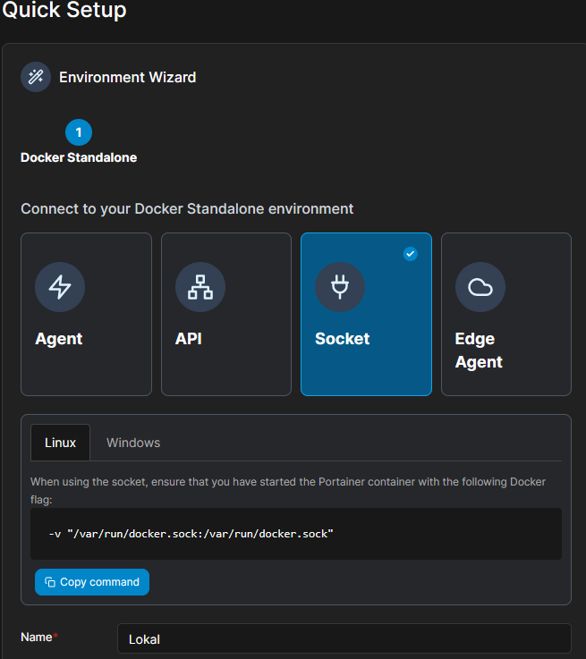

# Base

Is a collection of necessary software that creates the heart of Lokal.

## Variables to set

You only need to set a `lokal_secret` that will act as a seed for other
passwords and a `password_admin` that you will be using every time when
you will be asked to login as an admin user. An admin person in LDAP with
this password will be created. HTTP simple auth will use this password
as well (for protecting services that don't have own authentication such
as portainer).

### Available versions

- `version_prometheus`: https://hub.docker.com/r/prom/prometheus/tags
- `version_traefik`: https://hub.docker.com/_/traefik

## Portainer

Portainer comes with default "admin" user with `password_admin` password.
Upon first usage, it is necessary to set new environment defined by
the docker socket that is already bound to the portainer container.



## Prometheus

Base provide prometheus to gather your app's metrics. To let prometheus
auto-discover your service, simply add it to `prometheus` network and define
label `prometheus.port` so prometheus knows on which one (out of all exposed/published)
ports it should scrape the metrics.
If your service provides metrics on a different path then `/metrics` then you can
specify your custom path using `prometheus.path` label

```yaml
services:
  <your-service>:
    labels:
      prometheus.port: 8082
      prometheus.path: "/my/custom/metrics-endpoint"
      prometheus.interval: "1d" # e.g. 1d, 1h30m, 5m, 10s
```

**Sources**:

- relabelling config (what to put in the "relabel_config" section) https://prometheus.io/docs/prometheus/latest/configuration/configuration/#relabel_config
- example of dynamic docker service discovery https://github.com/prometheus/prometheus/blob/release-2.43/documentation/examples/prometheus-docker.yml